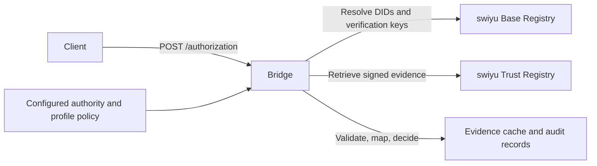

# swiyu bridge for TRQP and the Ayra TRQP Profile

Status: proposed specification, version 0.1.0. Updated: 2026-10-06.

## Purpose

Add a read-only TRQP and Ayra TRQP Profile API layer on top of the existing swiyu Base and Trust Registries. Expose evidence about swiyu entities through TRQP authorization queries. A client asks whether a named authority authorizes a particular entity to perform an action on a resource, for example `issue` on an exact credential type identifier. The bridge translates and validates source evidence; it does not issue new Swiss permissions.

MUST, MUST NOT, SHOULD, and MAY describe requirements of this proposed bridge profile. They are not claims about requirements imposed on swiyu itself.

## Source basis and compatibility

The [official architecture](https://swiyu-admin-ch.github.io/introduction/) describes the Base Registry as a source of DIDs and keys, without issuer/verifier role information. The Trust Registry binds those identifiers to real-world entities. Base Registry presence therefore MUST NOT be treated by this bridge as an authorization.

The [draft Trust Protocol 2.0](https://swiyu-admin-ch.github.io/specifications/trust-protocol-v2-0/) supplies identity statements (`idTS`), issuance permissions (`piaTS`, `sub`, `can_issue.vct`), protected-type lists (`piTLS`, `vct_values`), non-compliance lists (`ncTLS`), and protected-field permissions (`pvaTS`, `authorized_fields`). Statements use signed JWTs with type/profile, time, and status information. The [Swiss Profile Trust](https://swiyu-admin-ch.github.io/specifications/swiss-profile-trust/) specifies ecosystem policy and environment-specific anchors.

These upstream documents are drafts. An implementation MUST pin its environment, profile versions, API contract, and validation rules. It MUST verify actual API compatibility before claiming live support. In particular, the draft's issuance-authorization and issuance-trust-list collection descriptions appear interchanged. Verify paths, parameters, and returned types against the deployed OpenAPI contract; reject unexpected statement types. Do not infer production endpoints or anchors from integration examples.

This profile targets [TRQP v2 authorization](https://github.com/trustoverip/tswg-trust-registry-protocol/tree/main/specification/v2-approved). swiyu's Trust Protocol 2.0 and TRQP 2.0 are separate protocols. The bridge also targets the [Ayra TRQP Profile v0.6.0-draft](https://github.com/ayraforum/ayra-trust-registry-resources/blob/ec7768572592b50ba3f4102c026c2449148b5e11/spec/profile.md) and its [normative OpenAPI](https://github.com/ayraforum/ayra-trust-registry-resources/blob/ec7768572592b50ba3f4102c026c2449148b5e11/trqp_ayra_profile_swagger.yaml), inspected in the supplied local repository at commit `ec7768572592b50ba3f4102c026c2449148b5e11`. TRQP governs core semantics; the Ayra OpenAPI governs API shapes and status codes; the Ayra profile governs conformance policy.

## Architecture and authority



All Ayra `_id` values MUST be DID URI strings; field names remain `_id`, not `_did`. A resource such as a credential type URI is not an `_id` field and retains its source identifier. The bridge MUST configure an authority identifier independently of its own service identifier and source HTTP URLs. For each supported `authority_id`, configuration MUST identify the governance authority represented, permitted trust-statement signer DIDs, source endpoints, environment, and profile policy. A signer key MAY rotate without changing that authority identifier. A registry host or bridge operator MUST NOT be assumed to be the authorizing authority merely because it serves the evidence.

An Ayra RoR MAY recognize this authority for a specific action/resource scope and route clients to the bridge. That recognition is governed separately. This bridge MUST NOT manufacture `/recognition` relationships from Base Registry registration or verified identity. Anchoring the RoR operator itself is separate work: [Ayra RoR anchoring plan](https://github.com/darrellodonnell/trqp-ayra-fastapi/issues/5).

## Entity and authorization model

The bridge SHOULD maintain the following internal records; these are not additions to core TRQP schemas.

| Record | Required contents |
| --- | --- |
| Entity | Exact subject DID; source environment; resolution state; optional validated identity and name |
| Authorization | Authority ID; subject DID; action; exact resource; supporting statement IDs; evidence validity bounds; policy version |
| Evidence | Source URL; statement `jti`; content digest; signer/key ID; profile/type; retrieval time; validation/status time; result |
| Decision | Query tuple; evaluation time; outcome; reason code; evidence references; policy version |

Entity discovery MUST NOT assign roles or permissions from DID presence, keys, names, or advertised issuer metadata. An entity can exist with zero confirmed authorizations. A legal entity with several DIDs MUST be treated as several subjects unless a separately governed, verified linkage explicitly supports the requested mapping.

## Mapping rules

| Input evidence | Bridge interpretation |
| --- | --- |
| Resolvable Base Registry DID | Technical entity identity, no action/resource grant |
| Valid `idTS` for that DID | Verified identity evidence, no issuance grant |
| Valid `piaTS` | Candidate `entity_id=sub`, `action=issue`, `resource=can_issue.vct` |
| Valid current `piTLS` | Determines whether the credential type is within protected issuance scope |
| Valid current `ncTLS` | Exclusion input under this bridge's issuance policy |
| `pvaTS` | Optional future field-level mapping; never a general credential-type verification grant |

This profile's initial implementation MUST support only `issue` for explicitly supported protected credential types. It MUST compare DIDs and credential type identifiers exactly. Display names, URL dereferencing, case folding, prefixes, wildcards, and inferred schema equivalence MUST NOT broaden a grant. Aliases require a future separately versioned mapping policy.

The bridge MUST NOT infer `issue` permission for an unprotected type merely because no Swiss permission is required. It MUST NOT translate permission to request a protected field into `verify` on an entire credential type. Unknown resources outside configured coverage MUST produce an unsupported-query error, not a negative assertion about Swiss permissions.

## Authorization evaluation

For a supported issuance query, the bridge MUST:

1. Validate the TRQP request and select exactly one configured authority/environment policy. Reject unsupported authorities, actions, resources, or context semantics explicitly.
2. Resolve the subject DID using the pinned DID profile. Validate relevant DID history and signer verification methods with a standards-compliant resolver; a fetched document alone is insufficient evidence of integrity.
3. Retrieve matching identity and issuance statements plus applicable protected-type and non-compliance lists. Follow pagination completely where collection retrieval is required. An incomplete retrieval MUST NOT establish absence.
4. Validate each required artifact against configured signer trust anchors, allowed algorithms, expected statement type/profile, required claims, time bounds, and status rules. Validate status-list provenance under the pinned profile. A caller-supplied `kid` or source URL MUST NOT establish trust.
5. Require a valid identity statement and issuance statement for the exact subject, an exact credential type match, membership in a valid protected-type list, and absence of that subject from a completely evaluated current non-compliance list. This conjunction is this bridge profile's conservative issuance policy.
6. Return `authorized=true` only when every required condition is confirmed. Record the evidence and policy used.

Revoked, expired, or malformed candidate grants MUST NOT create a positive result. Evaluate any other candidate grants independently. A validated exclusion overrides a grant. An unresolvable status or required artifact, conflicting source data that cannot be resolved by the pinned policy, or incomplete retrieval produces an indeterminate service error unless a definitive exclusion already establishes a negative result.

`authorized=false` means authorization was not confirmed under this profile after sufficient evaluation. It MUST NOT be described as a universal legal prohibition. Identity-only records, completed empty grant results, expired grants with no remaining valid grant, revoked grants, and confirmed exclusions can yield false; upstream timeouts cannot be disguised as false.

## Ayra API surface

An Ayra-conforming bridge MUST implement both core endpoints. The initial delivery additionally implements the entity-focused optional extensions below. Unimplemented optional extensions MUST return 501 with RFC 7807 Problem Details; that rule never applies to core endpoints.

| Endpoint | Bridge behavior |
| --- | --- |
| `POST /authorization` | Evaluate exact entity/action/resource permissions from swiyu evidence |
| `POST /recognition` | Evaluate separately governed authority recognition records, described below |
| `GET /metadata` | Required bridge delivery feature: profile-compatible service identity, authority and governance discovery |
| `GET /entities/{entity_id}` | Entity DID, optional validated name, and documented technical/identity evidence state; no inferred role |
| `GET /entities/{entity_id}/authorizations` | Array of standard authorization responses for currently confirmed grants; never silently incomplete |
| `GET /entities` | Paginated `EntityListResponse`; implement authority filter, paired action/resource filters, `limit`, `offset`, and `time` according to OpenAPI |
| `GET /lookups/authorizations` | Supported action/resource vocabulary, not a list of universal permissions |
| `GET /lookups/didMethods` | Methods actually supported under the configured authority policy |
| `GET /lookups/assuranceLevels` | 501 initially; no invented equivalence between Swiss identity markers and Ayra assurance levels |
| `GET /ecosystems/{ecosystem_id}` | 501 initially |
| `GET /ecosystems/{ecosystem_id}/recognitions` | 501 initially; core recognition remains implemented |

Extension parameters, bodies and errors MUST follow the pinned OpenAPI. Paths containing DIDs require appropriate URL encoding. Entity listing MUST define its coverage as entities in the bridge's complete validated source snapshot, not every DID in Switzerland. An action/resource-filtered list MUST apply the same grant validation as `/authorization`. Pagination uses `items` and `pagination` with `limit`, `offset`, and `total`; no total may be guessed from a partial upstream page. Name fields come only from validated identity evidence. An implemented authorization listing returns an empty array only after a complete successful evaluation finds no confirmed grants.

The authorization listing has no `authority_id` query parameter in the pinned contract. This initial bridge therefore serves one authority per deployment, preventing ambiguity without inventing parameters. `/metadata` uses the optional `authority_id` selector. Metadata MUST conform to the strict Ayra schema: `id`, `name`, `description`, and permitted optional `controllers`, `authority_id`, `governance_framework_id`, `supported_did_methods`. Additional metadata properties are prohibited. Publish environment, profile, policy, evidence coverage, and freshness details in linked bridge documentation; do not put custom evidence objects in `/metadata`.

Illustrative metadata (placeholder DIDs):

```json
{
  "id": "did:example:swiyu-trqp-bridge",
  "name": "swiyu TRQP bridge demonstration",
  "description": "Read-only Ayra profile bridge for configured swiyu issuance evidence; demonstration environment.",
  "authority_id": "did:example:swiyu-governance-authority",
  "governance_framework_id": "did:example:governance-framework",
  "controllers": ["did:example:bridge-controller"],
  "supported_did_methods": ["webvh"]
}
```

The bridge registry DID SHOULD discover its TRQP endpoint. The served authority DID MUST make its governance framework discoverable under the selected authority policy. Creating a local demonstration authority DID does not grant permission to represent Swiss governance; such a deployment MUST describe its authority as demo governance over translated evidence until an appropriate authority mapping is established.

### Core recognition support

`POST /recognition` MUST query an explicit authority-governed store of scoped recognition records with target authority DID, action, resource, validity and provenance. An empty initialized store is supported; for known authority/target/vocabulary with no applicable record, return a standard 200 response with `recognized=false`. Unknown identifiers/vocabulary return 404. Unavailable or invalid recognition evidence returns a core 500 problem. No recognition record may be inferred from identity, registration, issuance permission or service reachability. Demo records MUST be labeled and separated from live authority records. This supplies Ayra's required core capability while retaining the authorization focus and making no claim that swiyu itself publishes recognition records.

A registry provides authority information; the relying party makes acceptance decisions. The bridge SHOULD support JWS responses once an interoperable mechanism is selected, but this draft MUST NOT invent a mandatory Ayra signing envelope.

## TRQP contract and examples

The bridge MUST implement `POST /authorization` with standard request/response fields. The following identifiers are illustrative placeholders, not actual swiyu authorities or registered entities.

```json
{
  "authority_id": "did:example:swiyu-governance-authority",
  "entity_id": "did:example:issuer-a",
  "action": "issue",
  "resource": "https://credentials.example/types/qualification"
}
```

A successful positive evaluation returns HTTP 200:

```json
{
  "authority_id": "did:example:swiyu-governance-authority",
  "entity_id": "did:example:issuer-a",
  "action": "issue",
  "resource": "https://credentials.example/types/qualification",
  "authorized": true,
  "time_evaluated": "2026-10-06T03:00:00Z",
  "message": "Authorization confirmed under swiyu bridge profile 0.1.0."
}
```

For a completed evaluation without a valid matching grant, the response uses the same tuple and `authorized=false`, with a concise reason. The bridge MUST preserve the queried tuple. If context is returned, it MUST preserve its accepted string-valued fields. Detailed evidence belongs in internal audit records or a documented separate extension; the bridge MUST NOT insert nested evidence objects into TRQP's string-valued context.

| Situation | HTTP result and problem code |
| --- | --- |
| Invalid context or malformed request | 400, `invalid-query` |
| Unknown authority/entity/action/resource | 404, `unsupported-query` |
| Historical/future time requested without support | 400, `unsupported-time` |
| Required upstream data/status unavailable or incomplete | 500, `evidence-unavailable` |
| Required upstream payload invalid or irreconcilable | 500, `invalid-upstream-evidence` |
| Authentication required and missing/invalid | 401, `unauthorized` |
| Rate limit exceeded | 429, RFC 7807 Problem Details; SHOULD include `Retry-After`; MUST NOT be cached |
| Conclusive decision | 200, standard authorization response |

Errors MUST use RFC 7807 Problem Details and `application/problem+json` with stable documented problem-type URIs, status, title, and a request correlation identifier. They MUST NOT include an authorization boolean. The HTTP status choices follow the pinned Ayra core OpenAPI; problem codes are bridge-defined. Core endpoints MUST NOT use 501. Unknown/uncovered tuples return 404; a known subject and supported tuple with completed evidence evaluation can return 200 false.

Version 0.1 supports current-time evaluation only, including extension `time` parameters. Unsupported extension time requests MUST use only errors permitted by that endpoint; for endpoints without a suitable error in the pinned OpenAPI, the entire extension MUST remain 501 until a compatible time policy/contract is settled. An implementation MUST NOT return an undocumented 400 from such an endpoint. This is a release prerequisite for the planned authorization-listing extension. A non-empty `context.time` MUST be rejected with `unsupported-time`; it MUST NOT be silently ignored or evaluated using today's status. A future historical extension requires retained, independently verifiable historical grant, key, policy, and revocation evidence. `time_evaluated` always denotes execution time.

## Freshness and operation

The bridge MUST define maximum ages for statement retrieval, DID/key material, and status checks. Cached authorization cannot outlive the earliest supporting expiry or any required freshness bound. Refreshed revocation/exclusion data MUST invalidate dependent positive decisions. Stale-positive fallback during upstream failure is prohibited. Negative decisions SHOULD have a short bounded cache lifetime so new grants are discoverable.

Configuration MUST separate demo/sandbox and operational sources, anchors, stores, and metadata. Fixtures MUST be labeled and MUST NOT appear as live Swiss evidence. Fetchers MUST constrain network destinations, redirects, sizes, timeouts, and pagination; arbitrary query locators MUST NOT trigger unrestricted network requests. Logs MUST avoid credentials, holder data, and unnecessary query correlation. This bridge deals with public entity trust evidence, not holder credentials or presentations.

## Delivery plan and conformance

1. Pin deployed contracts and authority policy; resolve the collection-endpoint ambiguity and environment choices.
2. Build a fixture-backed entity/evidence model and deterministic validator with injectable clocks and fetchers.
3. Implement both core endpoints, exact issuance mapping, governed recognition storage, and the planned Ayra entity/metadata/lookups extensions; validate examples and responses against the approved schemas.
4. Add controlled live sandbox fetchers, bounded caching, provenance, metadata describing supported coverage, and an opt-in smoke test.
5. Demonstrate an Ayra client querying a recognized bridge authority. Operational onboarding and recognition require separate governance approval.

A conforming implementation MUST test: matching grant; identity only; Base Registry presence only; wrong subject/type/authority/key/signature; resource mismatch; revoked/expired grant; valid alternate grant; non-compliance exclusion; unprotected/unsupported type; complete empty collection; missing pages; status/DID outage; unexpected upstream type; key rotation; cache expiry and invalidation; environment isolation; historical-time rejection; and unchanged TRQP tuple/schema compliance. Also test Ayra DID-only identifiers, strict metadata schema, governed positive/negative recognition, empty recognition store, optional-extension 501 behavior, extension shapes, list/filter/pagination completeness, lookup coverage, and 429 behavior. No ordinary automated test should require live swiyu access.

## Open implementation questions

- Which deployed environment and API/profile versions support all required evidence?
- What stable governance authority ID and signer mapping will the operator publish?
- What controlled credential-type coverage and freshness limits are appropriate?
- Does the operational service expose all required list/status evidence with the completeness guarantees this profile needs?

These questions block a live conformance claim, not implementation of a clearly labeled fixture demonstration.
